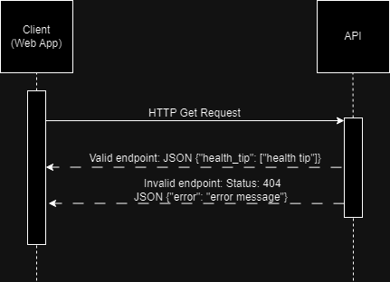

## Live API
You can access the live API at [https://finkli.pythonanywhere.com/](https://finkli.pythonanywhere.com/).

<h1>Health Tips API Documentation</h1>
<a href="https://github.com/Lisa-Fink/HealthTipsAPI">Github</a>
<p>This Flask REST API provides health tips based on different parameters like mood, temperature change, working out
    time, physical activity change, heart rate change, and sleep change.</p>

<h2>Endpoints</h2>
<ul>
    <li> /mood</li>
    <ul>
        <li>
            GET: <a href="https://finkli.pythonanywhere.com/mood/stormy">/mood/stormy</a>
        </li>
        <li>
            GET: <a href="https://finkli.pythonanywhere.com/mood/anxiety">/mood/anxiety</a>
        </li>
    </ul>
    <li> /temperature</li>
    <ul>
        <li>
            GET: <a href="https://finkli.pythonanywhere.com/temperature/increase">/temperature/increase</a>
        </li>
        <li>
            GET: <a href="https://finkli.pythonanywhere.com/temperature/decrease">/temperature/decrease</a>
        </li>
    </ul>
    <li> /working-out-time</li>
    <ul>
        <li>
            GET: <a href="https://finkli.pythonanywhere.com/working-out-time/increase">/working-out-time/increase</a>
        </li>
    </ul>
    <li> /physical-activity</li>
    <ul>
        <li>
            GET: <a href="https://finkli.pythonanywhere.com/physical-activity/decrease">/physical-activity/decrease</a>
        </li>
    </ul>
    <li> /heart-rate</li>
    <ul>
        <li>
            GET: <a href="https://finkli.pythonanywhere.com/heart-rate/improve">/heart-rate/improve</a></li>
        <li>GET: <a href="https://finkli.pythonanywhere.com/heart-rate/decrease">/heart-rate/decrease</a>
        </li>
    </ul>
    <li> /sleep-time</li>
    <ul>
        <li>
            GET: <a href="https://finkli.pythonanywhere.com/sleep-time/increase">/sleep-time/increase</a>
        </li>
        <li>GET: <a href="https://finkli.pythonanywhere.com/sleep-time/reduce">/sleep-time/reduce</a>
        </li>
    </ul>
    <h3>Response Format</h3>
    <pre>{"health_tip": "health tip string"}</pre>
    <h3>Error Response for invalid endpoint</h3>
    Status: 404
    <pre>{"error": "error message string"}</pre>
</ul>

## UML Diagram

    
## Installation
1. **Clone the Repository:**
   ```bash
   git clone https://github.com/Lisa-Fink/health-tips-api.git
   cd health-tips-api
2. **Create a Virtual Environment:**
    ```bash
    python -m venv .venv
3. **Activate the Virtual Environment:**
   - On Windows:
     ```bash
     .venv\Scripts\activate
   - On macOS/Linux:
     ```bash
     source .venv/bin/activate
4. **Install Dependencies:**
    ```bash
    pip install -r requirements.txt
## Usage (Local)
1. **Install using installation instructions**
2. **Run the Flask App:**
    ```bash
    flask --app app run
    ```
3. **Access the API:**
   - Open your browser and go to: http://localhost:5000/